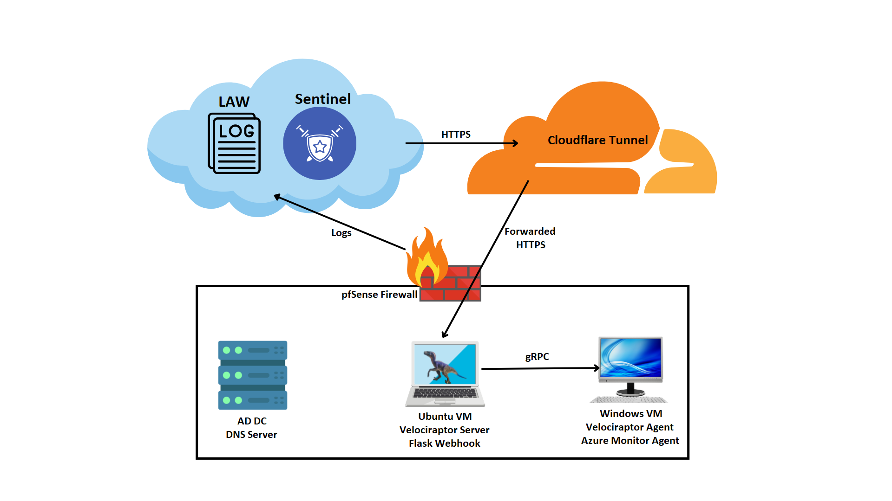

# Detection Lab (Sentinel <-> Velociraptor)
**Author:** Nikola Marković  
**Status:** MVP (ongoing)  
**Last updated:** 2025-12-28              
**Repo:** https://github.com/Oligo12/cyber-projects/                                                                   
**Email:** nikola.z.markovic@pm.me                                                                                                 
**LinkedIn:** https://www.linkedin.com/in/nikolazmarkovic/     
                                                                                                         
[Back to Main README](../README.md)

## Summary
Implemented Microsoft Sentinel playbook -> secure webhook -> Velociraptor API to terminate a target PID on alert. Demonstrates remote response workflows in a lab environment. Memory capture and file collection are planned.

## Notes
- Lab-only learning and prototype content. Velociraptor is used to simulate remote response actions via Logic App automation.
- This is a long-term lab and will be updated as I advance (e.g., adding other log sources, analyzing more malware samples).
- Paths in this README are **relative** to this folder.

## Status
- Core detections + kill-by-pid playbook wired
- Next: memdump & collect playbooks/artifacts, enrich, write general KQL and sigma rules.

## What’s here
- **[Detections:](detections)**  
  - **KQL:** Examples of Sentinel Analytics rules.
  - **sigma:** Examples of sigma rules. (Future work)
- **[Playbooks:](playbooks)** Playbooks used in this home lab.
- **[Evidence:](evidence)** Evidence of the playbooks, KQL, etc. working.
- **Images:** Just the images used throughout this section of the repo.

# Basic info

## Topology 

- **VMs:** Windows detonation client(s), AD DC/DNS, Ubuntu (Velociraptor server + webhook), pfSense.
- **Cloud:** Azure Arc + AMA -> Log Analytics Workspace -> Microsoft Sentinel.
- **Ingress:** Cloudflare Tunnel -> `https://webhook.[domain]/` -> Flask webhook -> Velociraptor API.

**Key IPs/Ports:**
- Velociraptor UI/API: **`:8889` / `:8001`**
- Webhook: **`:9999`** (behind Cloudflare)
- Detonation VM: **`192.168.1.101`**
- Velociraptor Server: **`192.168.1.20`**
- Client ID (lab): **`C.[example]`**

**Webhook (Flask) essentials**
- Validates `X-Auth-Token`, basic input checks.
- Calls Velociraptor server API with local config.
- Returns JSON status to Sentinel.

                                                                                                                                                                                                                              
*Flask webhook received `POST /kill` from the playbook and returned **200** (timestamps shown). `127.0.0.1` appears because the tunnel/proxy forwards to the local Flask service on `:9999`.*

**Velociraptor artifacts (VQL)**
- **Used:** `Windows.Remediation.Process` (terminate by PID/name)
- **Planned:** `Generic.System.Pstree`, `Windows.Memory.ProcessDump`, `Windows.Remediation.Quarantine`

## Simplified Data flow 
1. Sysmon/Windows -> AMA -> Log Analytics -> Sentinel.
2. Analytics rule fires.
3. Logic App playbook -> HTTPS POST to webhook (`/kill`).
4. Webhook validates token -> calls **Velociraptor** (VQL artifact) against **client_id**.
5. Results/evidence saved back to lab.

