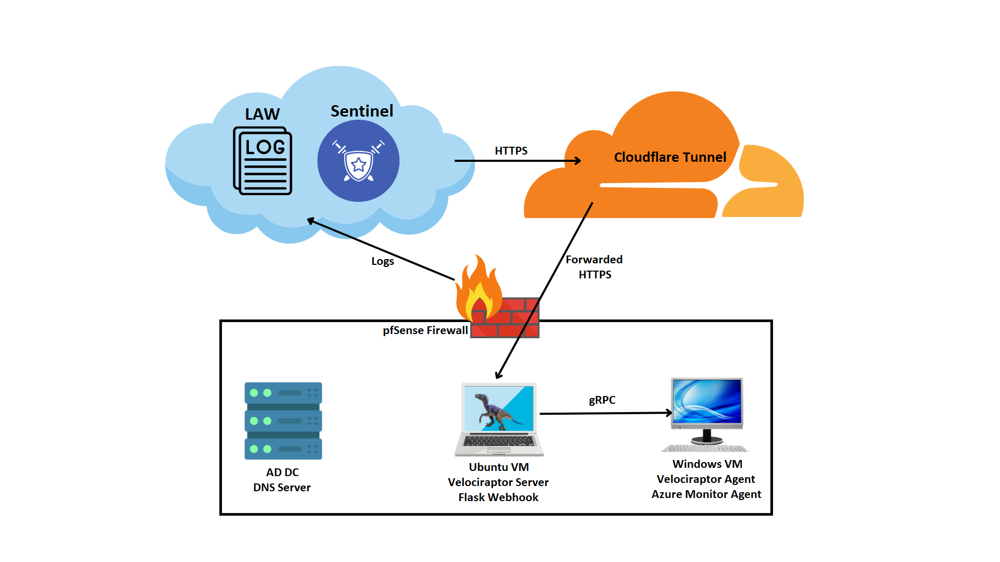
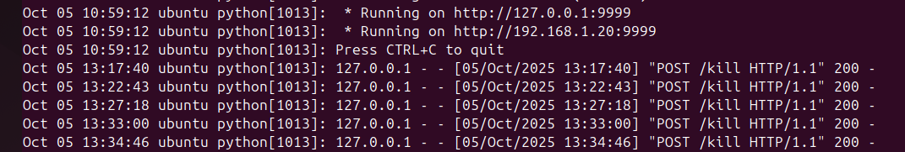

# Detection Lab: Microsoft Sentinel detections + response
**Author:** Nikola Marković  
**Status:** ongoing  
**Last updated:** 2026-09-29                                
**Repo:** https://github.com/Oligo12/cyber-projects/  
**Email:** nikola.z.markovic@pm.me  
**LinkedIn:** https://www.linkedin.com/in/nikolazmarkovic/  

[Back to Main README](../README.md)

## Summary
Microsoft Sentinel lab covering two areas:

- **AD identity attacks:** a small Active Directory domain attacked from Kali with six common techniques (password spray, Kerberoasting, AS-REP roasting, DCSync, privileged group addition, GPO modification). Each attack has a KQL detection validated against the lab's own telemetry, with log samples and documented blind spots.
- **Okta identity attacks:** a free Okta Integrator tenant attacked via browser over VPN with four techniques (password spray, MFA fatigue/push bombing, admin role grant, policy tampering). Each attack has a KQL detection validated against Okta System Log telemetry, benchmarked against Microsoft's built-in analytic rule templates.
- **Malware behavior + response:** KQL detections built from behaviors observed in my malware analyses, plus a Sentinel playbook -> secure webhook -> Velociraptor API workflow that terminates a target PID on alert.

## Notes
- Lab-only learning and prototype content.
- Paths in this README are **relative** to this folder.

## What's here
- **[detections/](detections):** all KQL detections, with an index table.
  - **[ad-identity/](detections/ad-identity):** 6 AD attack detections (AD-DET-001 to 006).
  - **[okta-identity/](detections/okta-identity):** 4 Okta attack detections (OKTA-DET-001 to 004).
  - **[malware/](detections/malware):** 7 behavior detections from malware analysis.
- **[log-samples/](log-samples):** query output from the lab for each AD detection.
- **[playbooks/](playbooks):** kill-by-pid response playbook and evidence of it working.
- **images/:** images used in this section of the repo.

## Status
- AD identity: 6 detections written and validated against lab attacks.
- Okta identity: 4 detections written and validated against lab attacks.
- Malware behavior: 7 detections written from malware analysis.
- Response: kill-by-pid playbook wired.

---

# AD identity detections

## Lab environment
| Host | Role | Appears in logs as |
|---|---|---|
| DC01 | Domain controller for `lab.local` (Windows Server 2025) | `WIN-72DM6NS4BVH` / `WIN-72DM6NS4BVH$` |
| CLIENT01 | Domain-joined workstation | Not involved in the attack chain, so no events in the log samples |
| Kali | Attacker | `10.10.10.50`, or `::ffff:10.10.10.50` in Kerberos events |

**Telemetry:** Advanced Audit Policy and command-line process auditing, deployed domain-wide via GPO. Events are shipped through Azure Arc + AMA + Data Collection Rules to Log Analytics workspace `law-1` and queried in Sentinel. All six detections use Windows Security events only. Sysmon is also deployed and collected, but not used by these detections.

## Attack chain
| Step | Attack | Tool | Detection |
|---|---|---|---|
| 1 | Password spray recovers j.schmidt's password | nxc, kerbrute | [AD-DET-001](detections/ad-identity/AD-DET-001_password-spray.md) |
| 2 | AS-REP roasting against j.schmidt (pre-auth disabled) | impacket-GetNPUsers | [AD-DET-003](detections/ad-identity/AD-DET-003_asrep-roasting.md) |
| 3 | Kerberoasting svc-sql with j.schmidt's credentials | impacket-GetUserSPNs | [AD-DET-002](detections/ad-identity/AD-DET-002_kerberoasting.md) |
| 4 | svc-sql holds replication rights: DCSync dumps all hashes | impacket-secretsdump | [AD-DET-004](detections/ad-identity/AD-DET-004_dcsync.md) |
| 5 | Account added to Domain Admins from a SYSTEM session | impacket-atexec | [AD-DET-005](detections/ad-identity/AD-DET-005_new-domain-admin.md) |
| 6 | GPO created and linked at the domain root | PowerShell (GroupPolicy module) | [AD-DET-006](detections/ad-identity/AD-DET-006_gpo-change.md) |

## Findings from validation
Every detection was run against the lab's own attack telemetry. Highlights from that validation:

- **Kerberoasting on Server 2025 negotiated AES**, so the classic RC4 filter (`0x17`) would have missed every attack. The detection uses request volume per account instead.
- **kerbrute userenum only logs the wrong guesses.** Nonexistent usernames produce 4768 with Status 0x6; valid usernames leave no trace in the Security log.
- **4728 alone only covers Domain Admins.** Enterprise Admins logs 4756 and the builtin groups and DnsAdmins log 4732. Groups are matched by SID, so renamed or localized names (for example "Domänen-Admins") are still caught.
- **4662 has no source IP.** The DCSync detection recovers it by joining to the 4624 logon on the same logon ID, which resolves the dump to Kali.

## Design notes
Detections query `SecurityEvent` directly rather than ASIM parsers. Five of the six rely on AD-specific fields (PreAuthType, replication GUIDs, gPLink) that no ASIM schema covers. Password spray is the one candidate for ASIM Authentication normalization, but the built-in Windows parser does not cover the Kerberos events (4768, 4771) the detection depends on.

---

# Okta identity detections

## Lab environment
| Component | Role |
|---|---|
| Okta tenant | Free Integrator Plan (`pm-integrator-9567628`), 5 test users |
| alice, bob, carol | Spray targets, no Okta Verify enrolled |
| dave | MFA fatigue victim, Okta Verify enrolled |
| eve | Starts with no admin rights, promoted mid-attack |
| Attacker vantage point | Browser over Proton VPN (Serbian exit node) |

**Telemetry:** Okta System Log ingested via Sentinel's Okta Single Sign-On (CCF) connector into `OktaV2_CL`, workspace `law-1`. All four detections query this table directly, not ASIM.

## Attack chain
| Step | Attack | Detection |
|---|---|---|
| 1 | Password spray against alice, bob, carol; bob's real password correct on round 3 | [OKTA-DET-001](detections/okta-identity/OKTA-DET-001_password-spray.md) |
| 2 | MFA fatigue against dave: 6 pushes spammed, 5 denied, 6th approved | [OKTA-DET-002](detections/okta-identity/OKTA-DET-002_mfa-fatigue.md) |
| 3 | eve granted Super Organization Administrator | [OKTA-DET-003](detections/okta-identity/OKTA-DET-003_new-admin.md) |
| 4 | eve creates then deletes a throwaway sign-on policy, ~1 and ~4 min after her own grant | [OKTA-DET-004](detections/okta-identity/OKTA-DET-004_policy-tampering.md) |

## Findings from validation
- Microsoft's built-in Okta templates would not have fired on any of the four simulated attacks - thresholds tuned for large tenants (15+ users for spray, 10+ pushes for fatigue) or dependent on Okta's risk engine flagging the session, which a fresh account with no sign-in history never triggers.
- `OktaV2_CL` already ships partially ASIM-shaped field names (`SrcIpAddr`, `EventResult`, `ActorUsername`) via the CCF connector, unlike the deprecated `Okta_CL` table.
- `OriginalTarget` is a dynamic array whose element order isn't guaranteed across event types, so target/role/policy extraction uses `mv-apply` matched by `type`, with a positional fallback for the one shape observed in this lab.

## Design notes
Detections query `OktaV2_CL` directly. ASIM normalization was intentionally skipped for Okta-only detections (see design notes on AD, same reasoning) but is planned for a single cross-source AD+Okta password spray detection once both identity sources are complete.

---

# Malware detections + response

## Topology
This is a separate environment from the AD identity lab above.

- **VMs:** Windows detonation client(s), AD DC/DNS, Ubuntu (Velociraptor server + webhook), pfSense.
- **Cloud:** Azure Arc + AMA -> Log Analytics Workspace -> Microsoft Sentinel.
- **Ingress:** Cloudflare Tunnel -> `https://webhook.[domain]/` -> Flask webhook -> Velociraptor API.

**Key IPs/Ports:**
- Velociraptor UI/API: **`:8889` / `:8001`**
- Webhook: **`:9999`** (behind Cloudflare)
- Detonation VM: **`192.168.1.101`**
- Velociraptor Server: **`192.168.1.20`**
- Client ID (lab): **`C.[example]`**

**Webhook (Flask) essentials**
- Validates `X-Auth-Token`, basic input checks.
- Calls Velociraptor server API with local config.
- Returns JSON status to Sentinel.

  
*Flask webhook received `POST /kill` from the playbook and returned **200** (timestamps shown). `127.0.0.1` appears because the tunnel/proxy forwards to the local Flask service on `:9999`.*

**Velociraptor artifacts (VQL)**
- **Used:** `Windows.Remediation.Process` (terminate by PID/name)

## Simplified data flow
1. Sysmon/Windows -> AMA -> Log Analytics -> Sentinel.
2. Analytics rule fires.
3. Logic App playbook -> HTTPS POST to webhook (`/kill`).
4. Webhook validates token -> calls **Velociraptor** (VQL artifact) against **client_id**.
5. Results/evidence saved back to lab.
