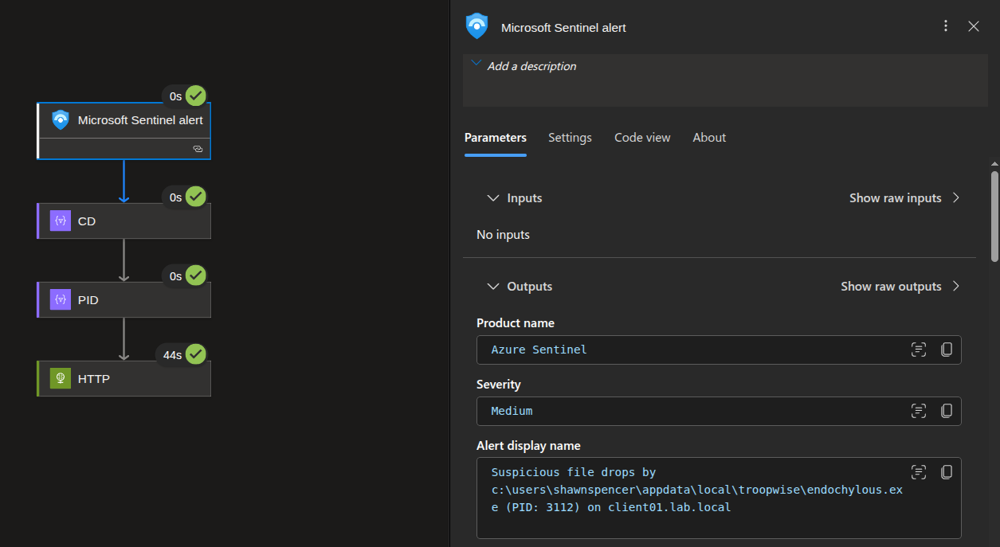
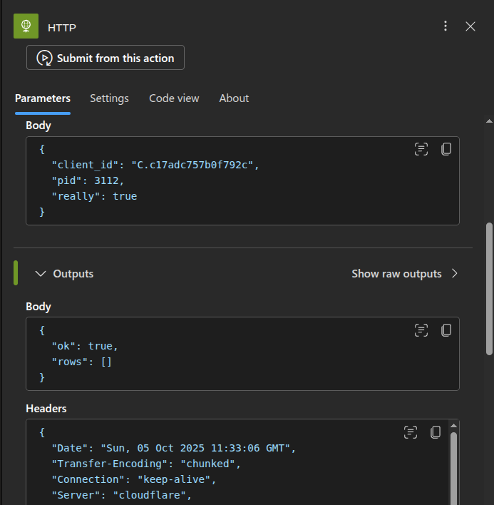
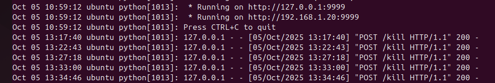
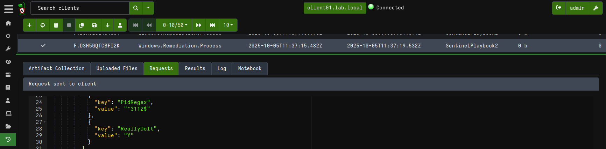
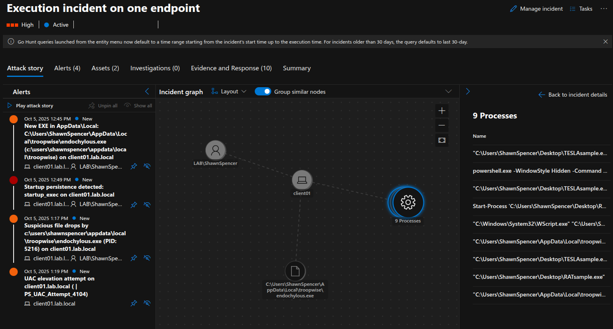

# Agent Tesla - lab run (2025-10-05)

[Back to Detection Lab](../README.md)                                                                                                          
[Back to Main README](../../README.md)

**Summary:** 
- Alerts fired on:
  - [AppData-Local first-seen EXE (new folder)](../detections/kql/appdata-local-new-exe.md)
  - [Startup-folder persistence (drop OR execute)](../detections/kql/startup-persistence.md)
  - [User-writable parent -> AppData/Temp drop (3m window)](../detections/kql/user-writable-parent-to-temp-appdata.md)
- [Playbook](../playbooks/kill-by-pid-velociraptor.md) posted `{client_id, pid}` to webhook -> Velociraptor killed PID. Lab-only.
- [Malware sample](../../malware-analysis/AgentTesla/Report.md) previously analyzed in [The Malware Analysis Lab](../../malware-analysis/).

## Trigger
- Detection: [User-writable parent -> AppData/Temp drop (3m window)](../detections/kql/user-writable-parent-to-temp-appdata.md)
- Host/User: client01 / LAB\user
- PID: 3112

## What happened
1) Sentinel alert -> Logic App ran (CD -> PID -> HTTP)
2) Webhook validated `X-Auth-Token`, forwarded to Velociraptor
3) VR job: kill PID (result: success)

Velociraptor Artifact used: Windows.Remediation.Process.

## Evidence (screens)
- Logic App run
  
  
                                                                                                                                                                           

- Webhook logs (200 OK)
  
                                                                                              
                                                                                                                                                      
- Velociraptor job completed
  
                                                                                                                                                                  
                                                                                                                                                            
- Incident attack story
  
  
  *The **UAC elevation attempt** is from QuasarRAT detonated shortly after AgentTesla*                                                                                                                                                        

## Notes / tuning
- Expect FP when installer spawns PowerShell.
- Next: add memdump step after kill.

