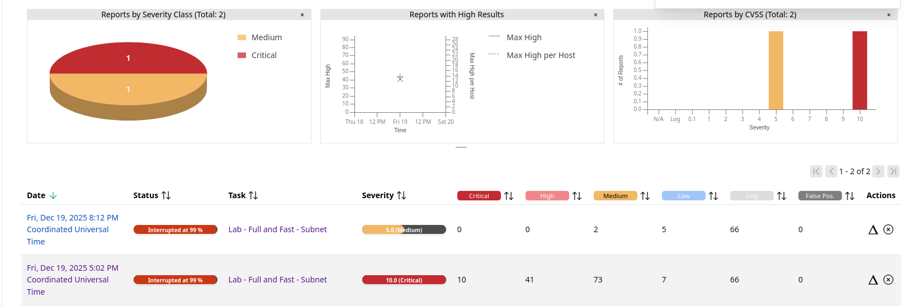

# Vulnerability Management Mini Lab - OpenVAS (Greenbone Community Edition)
**Author:** Nikola Marković  
**Status:** MVP (ongoing)  
**Last updated:** 2025-12-21  
**Repo:** https://github.com/Oligo12/cyber-projects/                                                                   
**Email:** nikola.z.markovic@pm.me                                                                                                 
**LinkedIn:** https://www.linkedin.com/in/nikolazmarkovic/     
                                                                                                         
[Back to Main README](../README.md)

## Goal
Demonstrate a basic vuln-management workflow: scan -> triage -> validate -> remediate -> rescan -> report.

## Lab Setup (high level)
- OpenVAS/GVM in Ubuntu VM (Docker)
- Targets:
  - Ubuntu Desktop VM (192.168.56.30)
  - Windows 10 VM (192.168.56.20)
- Scope: internal VirtualBox subnet

## What happened
- First scan produced critical/high package findings on Ubuntu.
- I applied vendor patches (`apt update && apt upgrade`) and rescanned.
- Result: critical/high reduced significantly; remaining findings were mostly configuration/exposure items.
- Note: scans were unstable and reports show "Interrupted at 99%", so I selected a small set of high-confidence findings (high QoD) to document.

## Scope & Limitations
- Scans were executed in an isolated VirtualBox lab subnet (not production).
- Some scans were interrupted at ~99%, so only **high-confidence findings** (high QoD) were selected.
- Findings represent **exposure and configuration risk**, not exploit proof.
- Validation focused on version checks, service exposure, and realistic attack surface.

## Before vs After (evidence)
Screenshot: 

## Findings (selected, validated examples)
- **Critical:** WebKitGTK / JavaScriptCoreGTK (Ubuntu USN-7395-1)  
  -> [critical-webkitgtk](findings/CRITICAL-webkitgtk.md)
- **High:** libssh (Ubuntu USN-7619-1)  
  -> [high-libssh](findings/HIGH-libssh.md)
- **Medium:** Windows RPC / MSRPC enumeration  
  -> [medium-rpc-135](findings/MEDIUM-rpc-135.md)
- **Low:** Weak SSH MAC algorithms  
  -> [low-ssh-weak-mac](findings/LOW-ssh-weak-mac.md)

## Ops Triage Summary (per host)
**Ubuntu (192.168.56.30):** Patch now: WebKitGTK/JavaScriptCoreGTK (USN-7395-1). Patch soon: libssh (USN-7619-1). Hardening: disable weak SSH MACs (policy-dependent).  
**Windows (192.168.56.20):** RPC/135 enumeration was blocked in this lab; enterprise action is to restrict RPC to trusted management hosts/subnets (no broad exposure).
- See: [Reporting templates](templates/)

