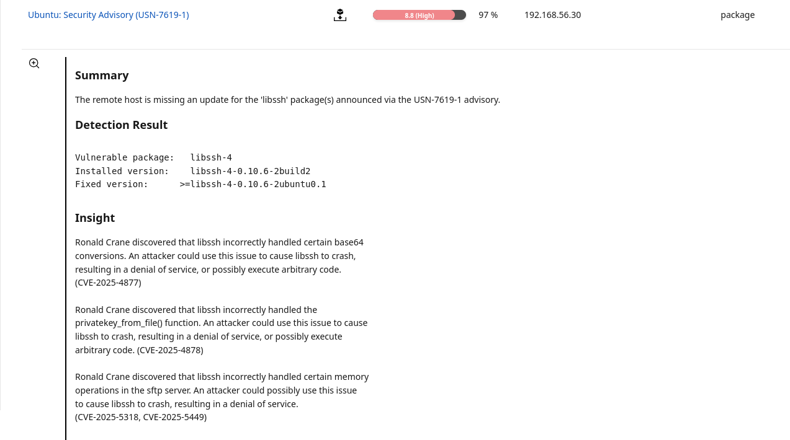

# High - libssh (Ubuntu USN-7619-1)

## Asset / Context
- Host: Ubuntu Desktop VM (192.168.56.30)
- Exposure: libssh is a shared library; impact depends on whether any installed application uses it in a reachable way.

## Finding
Missing security update for **libssh** (installed version below fixed version).

## Evidence
- OpenVAS finding: **Ubuntu: Security Advisory (USN-7619-1)**, Severity **8.8 (High)**, QoD **97%**
- Screenshot: 

## Risk
- If SSH/SFTP or any application using **libssh** is exposed, vulnerabilities can cause **denial of service** or potentially **code execution** depending on the CVE and usage.
- Risk is higher if an application that uses **libssh** is exposed to untrusted networks.

## Validation
- Confirm installed version:
  - `dpkg -l | grep libssh`
- Identify potential consumers of libssh:
  - `apt-cache rdepends libssh-4 | head`

## Remediation
- Apply vendor security updates:
  - `sudo apt update && sudo apt upgrade`
- Restart affected applications or reboot if required

## Priority / Notes
- **Patch now** (security library used by network-facing services).
- Impact depends on whether libssh is actively used by SSH/SFTP or other applications.
