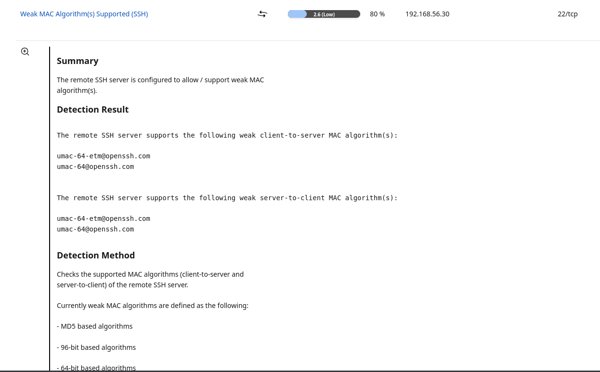

# Low - Weak SSH MAC Algorithms Enabled

## Asset / Context
- Host: Ubuntu Desktop VM (192.168.56.30)
- Exposure: SSH enabled (22/tcp)

## Finding
SSH server supports weak MAC algorithms (e.g., `umac-64` variants).

## Evidence
- OpenVAS finding: **Weak MAC Algorithm(s) Supported (SSH)**, Severity **2.6 (Low)**
- Screenshot: 

## Risk
Reduced cryptographic strength; usually a **hardening** item rather than an urgent vuln, unless policy requires strict crypto.

## Validation
- Check current server MACs:
  - `sudo sshd -T | grep -i '^macs'`

## Remediation
- Create `/etc/ssh/sshd_config.d/99-macs-hardening.conf` with an explicit strong `MACs` list.
- Then `sudo sshd -t && sudo systemctl restart ssh`.

## Priority / Notes
- Fix during maintenance / baseline hardening.