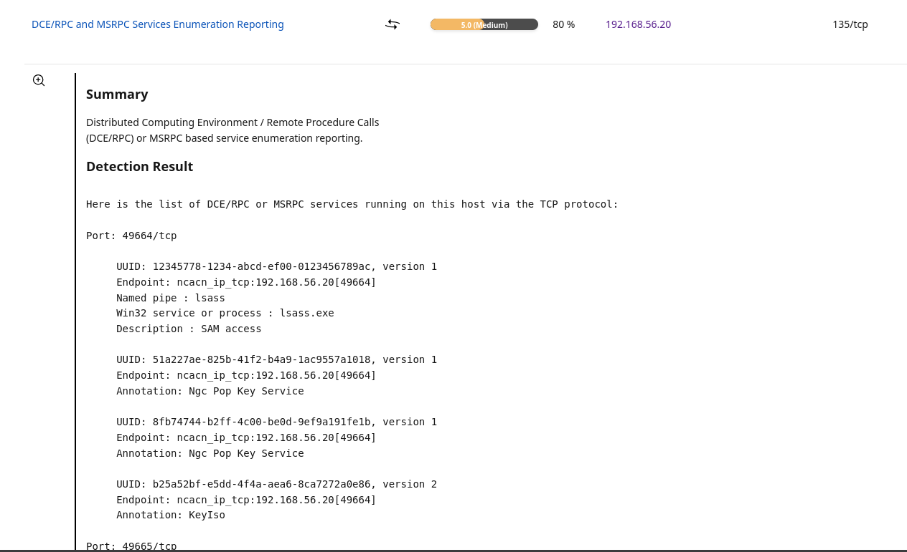

# Medium - Windows RPC / MSRPC Service Enumeration (135/tcp)

## Asset / Context
- Host: Windows 10 VM (192.168.56.20)
- Exposure: internal lab subnet
- Note: Windows RPC commonly uses **135/tcp (Endpoint Mapper)** + **dynamic high ports (e.g., 49664+)**

## Finding
OpenVAS reported that DCE/RPC/MSRPC services may be enumerable via RPC (typically starting at 135/tcp).

## Evidence
- OpenVAS finding: **DCE/RPC and MSRPC Services Enumeration Reporting**, Severity **5.0 (Medium)**, QoD **80%**
- Screenshot: 

## Risk
If reachable, RPC enumeration can support **recon and lateral movement** (identify exposed RPC interfaces/services).

## Validation
From the Ubuntu/OpenVAS host:
- Port reachability check:
  - `nmap -Pn -p 135 192.168.56.20`
  - Result: `135/tcp filtered`
- RPC enumeration attempt:
  - `impacket-rpcdump 192.168.56.20`
  - Result: `Could not connect / Connection refused`

**Conclusion:** In the current lab state, RPC enumeration from Ubuntu is **blocked**, so the practical risk is **reduced**.

## Remediation / Hardening
- Keep **135/tcp blocked** from untrusted hosts/subnets.
- If RPC is required, allow only from **trusted management subnets** and consider limiting dynamic RPC ports.
- Prefer segmentation + Windows Firewall scoping over broad "allow all" rules.

## Priority / Notes
- Enterprise: medium if accessible inside a large flat network; higher if exposed to untrusted segments.
- This lab: currently **effectively mitigated** (filtered from Ubuntu), documented as an attack-surface finding.